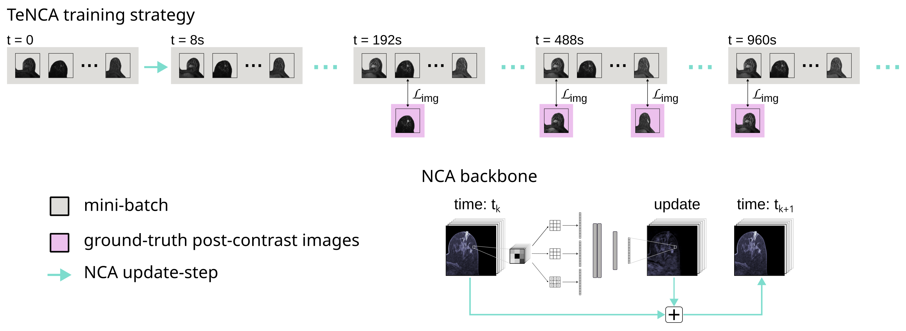

# Temporal Neural Cellular Automata: Application to modeling of contrast enhancement in breast MRI

Code for our [MICCAI 2025 paper](https://arxiv.org/abs/2506.18720).



## Usage

Run via:

`python main.py config/nca.yml`

## Cite as

```
@article{lang2025temporal,
  title={Temporal Neural Cellular Automata: Application to modeling of contrast enhancement in breast MRI}, 
  author={Daniel M. Lang and Richard Osuala and Veronika Spieker and Karim Lekadir and Rickmer Braren and Julia A. Schnabel},
  year={2025},
  eprint={2506.18720},
  archivePrefix={arXiv},
  primaryClass={eess.IV},
  url={https://arxiv.org/abs/2506.18720}, 
}
```
